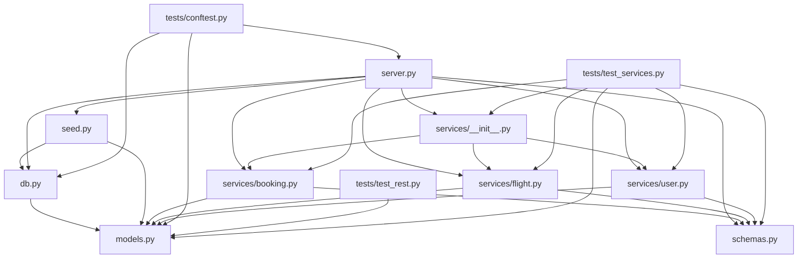

```mermaid
graph TD
    db_py["db.py"]
    models_py["models.py"]
    schemas_py["schemas.py"]
    seed_py["seed.py"]
    server_py["server.py"]
    services___init___py["services/__init__.py"]
    services_booking_py["services/booking.py"]
    services_flight_py["services/flight.py"]
    services_user_py["services/user.py"]
    tests_conftest_py["tests/conftest.py"]
    tests_test_rest_py["tests/test_rest.py"]
    tests_test_services_py["tests/test_services.py"]
    db_py --> models_py
    seed_py --> db_py
    seed_py --> models_py
    server_py --> db_py
    server_py --> schemas_py
    server_py --> seed_py
    server_py --> services___init___py
    server_py --> services_booking_py
    server_py --> services_flight_py
    server_py --> services_user_py
    services___init___py --> services_booking_py
    services___init___py --> services_flight_py
    services___init___py --> services_user_py
    services_booking_py --> models_py
    services_booking_py --> schemas_py
    services_flight_py --> models_py
    services_flight_py --> schemas_py
    services_user_py --> models_py
    services_user_py --> schemas_py
    tests_conftest_py --> db_py
    tests_conftest_py --> models_py
    tests_conftest_py --> server_py
    tests_test_rest_py --> models_py
    tests_test_services_py --> models_py
    tests_test_services_py --> schemas_py
    tests_test_services_py --> services___init___py
    tests_test_services_py --> services_booking_py
    tests_test_services_py --> services_flight_py
    tests_test_services_py --> services_user_py
```
